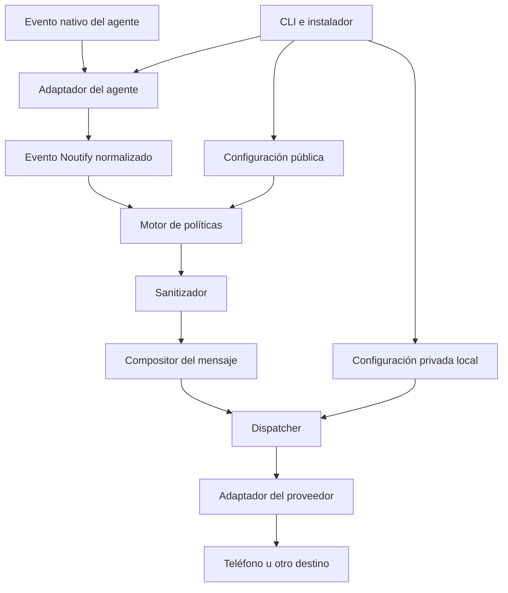

# Noutify — Contexto maestro del proyecto

> Estado: contexto canónico; Fase 0 implementada con aceptación móvil pendiente
> Última actualización: 2026-08-07
> Audiencia: personas y agentes de programación que diseñen, implementen o revisen Noutify

## 1. Cómo usar este documento

Este archivo conserva la visión, las decisiones y los límites de Noutify para que
el proyecto pueda retomarse sin reconstruir su contexto desde conversaciones
anteriores.

Antes de proponer o implementar cambios:

1. leer este documento completo;
2. inspeccionar el estado real del repositorio;
3. identificar la fase activa del roadmap;
4. distinguir una decisión confirmada de una posibilidad futura;
5. no ampliar el alcance sin autorización explícita;
6. actualizar este documento cuando cambie una decisión estructural.

### Precedencia de fuentes

Si dos fuentes se contradicen, usar este orden:

1. la instrucción más reciente y explícita del usuario;
2. el código y las pruebas para describir el comportamiento ya implementado;
3. este documento para la visión, los principios y la arquitectura objetivo;
4. otros documentos del repositorio;
5. hipótesis o conversaciones históricas.

No resolver contradicciones importantes en silencio. Exponerlas y pedir una
decisión cuando afecten el producto, la seguridad o el alcance.

---

## 2. Resumen ejecutivo

Noutify es un sistema local y portable que conecta los agentes de programación
con el teléfono del usuario. Su propósito es permitir que una persona deje de
vigilar constantemente el editor o la terminal y reciba un aviso breve cuando
el agente termina un turno, necesita intervención, completa un bloque real o no
puede continuar.

La propuesta central es:

> **Notificaciones móviles universales para agentes de programación.**

Noutify no depende de un editor, lenguaje o tipo de aplicación. Debe poder
integrarse en un repositorio web, móvil, de escritorio, infraestructura, datos o
en un repositorio vacío.

El sistema traduce eventos propios de cada agente a estados universales, aplica
políticas de veracidad y seguridad, sanitiza el contenido y delega el envío a un
proveedor intercambiable.

### Estado de implementación

La Fase 0 dispone de una implementación TypeScript comprobada para Windows,
Claude Code y ntfy. Incluye el evento `WAITING`, configuración pública/privada,
instalación idempotente del hook, prueba, confirmación, diagnóstico y
desinstalación. La recepción en un teléfono real y el aviso automático de un
turno posterior siguen siendo puertas manuales de aceptación; no deben darse por
completadas hasta que el usuario las confirme.

---

## 3. Problema que resuelve

Los agentes de programación pueden trabajar durante suficiente tiempo como para
que vigilar continuamente la sesión sea una mala experiencia. El usuario
necesita saber cuándo volver, pero cada agente expone eventos, hooks y formatos
distintos.

Las soluciones basadas únicamente en instrucciones dentro del prompt son
frágiles: el modelo puede olvidar notificar, interpretar mal el estado o incluir
información que no debería abandonar la máquina.

Noutify resuelve el problema mediante integraciones deterministas:

- escucha eventos nativos del agente;
- los normaliza a un vocabulario común;
- decide si corresponde avisar;
- elimina información sensible;
- construye un mensaje breve y veraz;
- lo entrega mediante el proveedor configurado;
- nunca interfiere con la tarea principal si el canal de notificación falla.

---

## 4. Visión de producto

La experiencia objetivo es prácticamente “un prompt y listo”:

1. Noutify se incorpora al proyecto.
2. El usuario le pide a su agente: `Configura Noutify para este proyecto`.
3. El asistente detecta el entorno y las integraciones compatibles.
4. Explica cómo conectar el teléfono.
5. Instala la integración sin destruir configuración existente.
6. Envía una notificación de prueba.
7. El usuario confirma que la recibió.
8. Solo entonces la instalación queda activa.

El resultado debe permitir al usuario alejarse del computador con confianza:
Noutify le avisará cuando su atención vuelva a ser útil.

### Promesa de producto

- instalación guiada para usuarios no técnicos;
- funcionamiento local y sin infraestructura propia en las primeras versiones;
- compatibilidad progresiva con varios agentes y sistemas operativos;
- privacidad por defecto;
- comportamiento determinista e independiente de la memoria del modelo;
- instalación reversible y respetuosa de la configuración preexistente.

---

## 5. Alcance y límites

### Noutify sí es

- un runtime local de notificaciones;
- una capa de normalización de eventos de agentes;
- un conjunto de adaptadores instalables y reversibles;
- una interfaz común para proveedores de notificación;
- un asistente de configuración que una IA puede ejecutar;
- una CLI para instalar, probar, diagnosticar y desinstalar;
- una carpeta o paquete portable entre proyectos.

### Noutify no es

- un sistema de notificaciones de negocio para los usuarios de la aplicación
  que se esté desarrollando;
- una extensión exclusiva de Visual Studio, VS Code o cualquier otro editor;
- un reemplazo del reporte visible del agente;
- un lector o resumen remoto de conversaciones;
- una aplicación móvil propia;
- un servidor, SaaS, base de datos o sistema de cuentas;
- una plataforma de observabilidad o telemetría;
- un sistema que concede o deniega permisos al agente.

### Fuera del MVP

- aplicación móvil Noutify;
- backend o cuentas Noutify;
- panel web o interfaz gráfica;
- extensión para un editor específico;
- marketplace;
- telemetría remota;
- historial centralizado de conversaciones;
- proveedores adicionales a ntfy;
- agentes adicionales al adaptador inicial;
- códigos QR y deep links;
- automatizaciones empresariales complejas.

---

## 6. Principios no negociables

### 6.1 Determinismo antes que memoria del modelo

Los hooks o eventos nativos son el mecanismo principal. El agente no debe tener
que “recordar” ejecutar una notificación al final de cada turno.

### 6.2 Veracidad antes que entusiasmo

Una notificación nunca debe afirmar que algo fue implementado, validado o
completado si no ocurrió. Terminar una respuesta no equivale a terminar una
tarea.

### 6.3 Privacidad por defecto

Una notificación es un timbre, no un resumen de la conversación. Debe contener
el mínimo contexto necesario y nunca transportar transcript completo, contenido
de archivos, prompts, logs, credenciales o información personal.

### 6.4 Fallar sin interferir

Un fallo del proveedor no debe bloquear, modificar ni prolongar de forma
significativa la tarea del agente.

### 6.5 Integraciones conservadoras

La instalación hace backup y merge. Nunca reemplaza configuraciones existentes.
La desinstalación elimina exclusivamente las entradas creadas por Noutify.

### 6.6 Core agnóstico

El core no conoce detalles de Claude Code, Gemini, Copilot, Codex, ntfy ni del
editor utilizado. Los adaptadores y proveedores encapsulan esas diferencias.

### 6.7 Local primero

La primera etapa funciona sin backend Noutify, sin cuentas y sin base de datos.
La configuración privada permanece en la máquina del usuario.

### 6.8 Idempotencia

Ejecutar `setup` más de una vez no debe duplicar hooks, modificar datos no
relacionados ni degradar una instalación válida.

---

## 7. Modelo universal de eventos

Noutify utiliza un vocabulario independiente del agente:

| Evento | Significado | Cuándo usarlo |
|---|---|---|
| `WAITING` | El agente terminó su turno y devolvió el control al usuario. | Siempre que una sesión quede esperando el siguiente prompt, aunque el trabajo esté parcial o bloqueado. |
| `ACTION_REQUIRED` | El agente no puede continuar sin una acción o aprobación humana concreta. | Permisos, confirmaciones destructivas o decisiones que requieren autoridad del usuario. |
| `COMPLETED` | El bloque solicitado terminó realmente y se ejecutaron las validaciones correspondientes. | Solo cuando existe evidencia suficiente de finalización. |
| `BLOCKED` | El progreso quedó completamente detenido y el agente agotó las alternativas seguras disponibles. | Dependencia externa, acceso faltante o condición imposible de resolver localmente. |
| `ERROR` | Ocurrió una falla técnica relevante. | Para registrar una falla que merece aviso; no implica por sí sola bloqueo total. |

### Diferencias esenciales

- `WAITING` describe el estado de la conversación, no el resultado del trabajo.
- `COMPLETED` es una afirmación fuerte y requiere verificación.
- `ACTION_REQUIRED` implica que el usuario puede desbloquear el trabajo mediante
  una acción concreta.
- `BLOCKED` significa que el agente no puede resolver ni rodear el obstáculo con
  los recursos disponibles.
- `ERROR` puede ser recuperable. Un test fallido que todavía puede investigarse
  no debe escalarse automáticamente a `BLOCKED`.

### Reglas de coexistencia

- Cada turno debe producir como máximo un aviso equivalente a `WAITING`.
- Si `COMPLETED` y `WAITING` ocurren juntos y dos avisos serían redundantes, la
  política puede colapsarlos en uno: “trabajo completado; esperando instrucción”.
- No emitir `ACTION_REQUIRED` y `BLOCKED` por la misma causa.
- Los estados deben deduplicarse por evento, sesión y transición, no solo por el
  texto del mensaje.
- `COMPLETED` no debe inferirse únicamente desde un hook que solo sabe que el
  turno terminó.

### Contrato mínimo del evento normalizado

```ts
type NoutifyEventType =
  | "WAITING"
  | "ACTION_REQUIRED"
  | "COMPLETED"
  | "BLOCKED"
  | "ERROR";

interface NoutifyEvent {
  type: NoutifyEventType;
  occurredAt: string;
  project: string;
  agent?: string;
  sessionId?: string;
  sourceEvent?: string;
  summary?: string;
  correlationId?: string;
  metadata?: Record<string, unknown>;
}
```

Este contrato es conceptual. El esquema definitivo debe versionarse y validarse
antes de considerarlo API pública.

---

## 8. Arquitectura objetivo



### 8.1 CLI

Punto de entrada humano y automatizable. Debe ofrecer al menos:

```text
noutify setup
noutify notify <event>
noutify test
noutify doctor
noutify uninstall
```

La CLI valida entradas, presenta resultados comprensibles y usa códigos de
salida estables. No contiene reglas específicas de un agente o proveedor.

### 8.2 Instalador

Responsable de:

- detectar sistema operativo, proyecto y agentes compatibles;
- localizar configuraciones existentes;
- mostrar el plan antes de modificar archivos sensibles;
- crear backups recuperables;
- fusionar hooks de forma idempotente;
- instalar solo componentes compatibles;
- escribir configuración pública y privada en sus ubicaciones correctas;
- probar la integración;
- revertir sus propios cambios si la instalación no puede completarse.

### 8.3 Adaptadores de agentes

Cada adaptador conoce exclusivamente el ciclo de vida de un agente:

- detección;
- eventos disponibles;
- traducción al modelo Noutify;
- instalación, validación y desinstalación de hooks;
- limitaciones de la integración.

Interfaz conceptual:

```ts
interface AgentAdapter {
  detect(): Promise<DetectionResult>;
  install(context: InstallContext): Promise<InstallResult>;
  validate(context: InstallContext): Promise<ValidationResult>;
  uninstall(context: InstallContext): Promise<UninstallResult>;
  normalize(input: unknown): Promise<NoutifyEvent | null>;
}
```

### 8.4 Core

El core contiene unidades pequeñas y separadas:

- `event-normalizer`: valida y normaliza eventos;
- `policy-engine`: decide si corresponde avisar, combinar o descartar;
- `sanitizer`: elimina información sensible;
- `message-composer`: produce títulos, cuerpos, prioridad y etiquetas;
- `deduplicator`: evita avisos repetidos para la misma transición;
- `dispatcher`: ejecuta el proveedor con timeout y retry acotado;
- `config-loader`: combina configuración pública, local y variables de entorno.

### 8.5 Proveedores

El core depende de una interfaz, no de un servicio concreto:

```ts
interface NotificationProvider {
  test(): Promise<ProviderTestResult>;
  send(notification: Notification): Promise<SendResult>;
}
```

La primera implementación será ntfy. Otros proveedores solo se añaden después
de validar la experiencia central.

### 8.6 Asistente operativo para agentes

El proyecto debe incluir una especificación ejecutable por un agente, por
ejemplo `SETUP.md`. No sustituye al instalador: le indica al agente cómo invocar
el software, qué preguntas hacer y qué condiciones verificar.

El asistente debe:

- detectar antes de asumir;
- explicar cada interacción requerida del usuario;
- no escribir secretos en archivos versionados;
- no reemplazar hooks;
- no declarar éxito antes de una prueba confirmada;
- detenerse si una decisión requiere autoridad del usuario.

---

## 9. Flujo de una notificación

1. El agente emite un evento nativo.
2. Su adaptador valida la entrada y la traduce a `NoutifyEvent`.
3. El motor de políticas comprueba configuración, relevancia y deduplicación.
4. El sanitizador reduce el contenido a datos permitidos.
5. El compositor crea un mensaje corto y veraz.
6. El sanitizador inspecciona también la salida final.
7. El dispatcher selecciona el proveedor y aplica timeout.
8. Si ocurre un error transitorio, puede realizar un único reintento.
9. El resultado se registra localmente de forma mínima y sanitizada.
10. El hook termina sin alterar la decisión o el flujo del agente.

### Contrato de no interferencia

Los hooks de notificación deben:

- escribir cero contenido en `stdout` cuando el agente interprete esa salida;
- no conceder ni denegar permisos;
- tener un timeout corto;
- finalizar de manera segura aunque la entrada sea inválida;
- no leer transcripts si el evento puede resolverse sin ellos;
- no bloquear la respuesta del agente por una falla del proveedor.

---

## 10. Política de mensajes

### Formato base

```text
[Proyecto o componente]: [estado o acción]
```

Ejemplos genéricos:

```text
Mi proyecto: El agente terminó su respuesta y espera instrucciones.
API: Se requiere aprobación para modificar la configuración.
Migración: Trabajo completado y validaciones aprobadas.
Despliegue: Bloqueado por credenciales no disponibles.
```

### Reglas

- una sola línea cuando sea posible;
- longitud corta, con un máximo configurable y un valor inicial recomendado de
  aproximadamente 180 caracteres;
- cero saludos y despedidas;
- alto contexto con el mínimo de palabras;
- estado real, no intención futura;
- truncar solo después de sanitizar;
- indicar visualmente cuando el mensaje fue truncado;
- no copiar entradas completas de herramientas;
- no incluir logs, stack traces ni metadata cruda.

### Contenido prohibido

- secretos, tokens, contraseñas y claves API;
- variables de entorno y archivos de credenciales;
- direcciones de correo y otros datos personales;
- URLs privadas o con credenciales;
- cookies y cabeceras de autorización;
- comandos completos cuando puedan contener datos sensibles;
- SQL, contenido de archivos o fragmentos extensos de código;
- prompts, transcripts o razonamiento interno;
- identificadores sensibles;
- logs persistentes sin sanitizar.

Cuando no pueda obtenerse un resumen seguro, usar un mensaje genérico. Es mejor
perder detalle que filtrar información.

---

## 11. Configuración y seguridad

### Separación obligatoria

La configuración versionable describe el comportamiento compartido:

```json
{
  "version": 1,
  "project": {
    "name": "My Project"
  },
  "provider": {
    "type": "ntfy"
  },
  "events": {
    "waiting": true,
    "actionRequired": true,
    "completed": true,
    "blocked": true,
    "error": true
  }
}
```

La configuración privada local contiene el destino y la autenticación:

```json
{
  "server": "https://ntfy.example",
  "topic": "<private-high-entropy-topic>"
}
```

El nombre y la ubicación definitivos de estos archivos siguen abiertos, pero la
separación entre datos públicos y privados no está abierta a negociación.

### Reglas de almacenamiento

- la configuración privada debe estar ignorada por Git;
- debe existir un archivo de ejemplo sin valores reales;
- nunca incluir endpoints, topics, tokens o credenciales reales en
  documentación, commits, issues, pull requests, capturas o fixtures;
- permitir variables de entorno para CI y entornos administrados;
- validar permisos y formato antes de usar archivos locales;
- no registrar el cuerpo completo enviado al proveedor en modo normal.

### Precedencia de configuración propuesta

1. variables de entorno explícitas;
2. configuración privada local;
3. configuración pública del proyecto;
4. valores predeterminados seguros.

### Seguridad de ntfy

En un servidor público, un topic sin autenticación debe tratarse como un secreto.
Noutify debe generar por defecto un identificador aleatorio con alta entropía y
permitir que el usuario lo reemplace conscientemente. Para organizaciones deben
contemplarse servidores privados, autenticación, tokens y controles de acceso,
sin incorporarlos al primer MVP.

---

## 12. Instalación asistida

### Objetivo

Una persona no técnica debe poder completar la configuración con instrucciones
claras y sin editar manualmente archivos de hooks.

### Flujo de `setup`

1. Detectar sistema operativo, raíz del proyecto y runtime disponible.
2. Detectar agentes compatibles y configuraciones de hooks existentes.
3. Informar qué se encontró y qué cambios propone Noutify.
4. Solicitar consentimiento antes de modificar configuración sensible.
5. Crear un backup verificable.
6. Instalar o actualizar componentes mediante merge idempotente.
7. Crear la configuración pública sin datos privados.
8. Crear o solicitar la configuración local privada.
9. Generar un topic aleatorio de alta entropía por defecto.
10. Guiar al usuario para instalar y abrir la aplicación móvil del proveedor.
11. Indicar cómo suscribirse al topic.
12. Enviar una notificación de prueba.
13. Preguntar al usuario si la recibió.
14. Marcar la instalación activa solo después de la confirmación.
15. Ejecutar `doctor` y presentar un resumen final.

### Onboarding del teléfono

El primer proveedor es ntfy. El asistente debe explicar, en lenguaje sencillo:

1. dónde obtener la aplicación compatible con el teléfono;
2. cómo añadir una suscripción;
3. qué servidor utilizar;
4. qué topic privado pegar;
5. cómo confirmar que la prueba llegó.

Si la prueba no llega:

- no marcar `setupCompleted`;
- comprobar conectividad, servidor y topic;
- ofrecer un reintento explícito;
- ejecutar diagnóstico sin revelar el topic;
- permitir revertir o dejar la instalación incompleta de forma segura.

### Instalación reversible

`noutify uninstall` debe:

- detectar exactamente qué entradas pertenecen a Noutify;
- eliminar solo esas entradas;
- conservar todos los hooks y ajustes ajenos;
- ofrecer conservar o eliminar la configuración privada;
- validar que la configuración restante siga siendo válida;
- informar qué backup existe y cómo recuperarlo.

---

## 13. Diagnóstico y manejo de errores

### `noutify doctor`

Debe comprobar al menos:

```text
✓ configuración pública válida
✓ configuración privada localizada y protegida
✓ adaptador del agente detectado
✓ hooks Noutify instalados una sola vez
✓ configuración original preservada
✓ runtime disponible
✓ proveedor accesible
✓ prueba de envío ejecutable
```

### Política de fallos

- El proveedor tiene timeout corto.
- Solo se permite un reintento automático para errores transitorios conocidos.
- No hay bucles de reintento.
- Un fallo de notificación no se transforma en `BLOCKED` para la tarea principal.
- Los errores se reportan de forma breve y sanitizada.
- Una entrada de hook inválida usa un fallback seguro.
- El modo `dry-run` prueba parseo, sanitización, composición e instalación sin
  enviar una notificación real.
- Los hooks finalizan sin modificar el comportamiento del agente.

---

## 14. Estructura inicial propuesta

La estructura exacta puede ajustarse durante el plan de implementación, pero
las fronteras conceptuales deben conservarse:

```text
noutify/
├── README.md
├── SETUP.md
├── NOUTIFY_CONTEXT.md
├── package.json
├── noutify.config.json
├── .noutify.local.example.json
├── src/
│   ├── cli/
│   ├── core/
│   │   ├── event-normalizer.ts
│   │   ├── policy-engine.ts
│   │   ├── sanitizer.ts
│   │   ├── message-composer.ts
│   │   ├── deduplicator.ts
│   │   ├── dispatcher.ts
│   │   └── config-loader.ts
│   ├── agents/
│   │   └── claude-code/
│   ├── providers/
│   │   └── ntfy/
│   └── installer/
├── scripts/
│   ├── noutify.ps1
│   └── noutify.sh
├── docs/
│   ├── security.md
│   ├── troubleshooting.md
│   └── providers/
└── tests/
```

### Lenguaje y runtime

La línea base es **TypeScript sobre Node.js** porque facilita:

- distribución mediante npm/npx;
- JSON y configuración multiplataforma;
- compatibilidad con Windows, macOS y Linux;
- pruebas unitarias de core, adaptadores e instalador;
- wrappers mínimos en PowerShell o shell cuando un hook lo requiera.

PowerShell y shell son adaptadores de ejecución, no el core del producto.

---

## 15. Estrategia de pruebas

### Unitarias

- traducción de cada evento nativo al estado correcto;
- diferencia entre `WAITING` y `COMPLETED`;
- reglas de combinación y deduplicación;
- sanitización de secretos, correos, URLs con credenciales y comandos;
- límite y truncado de mensajes;
- precedencia de configuración;
- clasificación de errores transitorios;
- construcción de notificaciones por prioridad.

### Integración

- merge de configuraciones con hooks preexistentes;
- segunda ejecución de `setup` sin duplicados;
- desinstalación que elimina solo entradas Noutify;
- backup y restauración;
- hook con JSON válido, inválido y vacío;
- garantía de `stdout` vacío;
- proveedor simulado con éxito, timeout y error transitorio;
- ausencia de secretos en logs y snapshots.

### End-to-end inicial

En un proyecto limpio de Windows con Claude Code y ntfy:

1. incorporar Noutify;
2. pedir al agente que lo configure;
3. detectar correctamente el entorno;
4. preservar hooks existentes;
5. guiar la suscripción del teléfono;
6. enviar una prueba;
7. recibir confirmación del usuario;
8. terminar un turno posterior;
9. recibir automáticamente el aviso correspondiente.

### Seguridad

- escaneo del repositorio para impedir topics y credenciales reales;
- entradas maliciosas o inesperadas del hook;
- contenido sensible más allá del límite de truncado;
- URLs con autenticación embebida;
- variables cuyos nombres indiquen secretos;
- mensajes genéricos cuando la sanitización no puede garantizar seguridad.

---

## 16. Criterios de aceptación del MVP

El MVP se considera demostrado cuando:

- funciona de extremo a extremo en Windows;
- integra Claude Code mediante hooks deterministas;
- usa ntfy como proveedor;
- notifica al terminar un turno sin confundirlo con trabajo completado;
- notifica una solicitud real de aprobación;
- puede representar bloqueo y error sin exagerar su severidad;
- no incluye secretos ni transcript en la notificación;
- conserva hooks existentes;
- `setup` es idempotente;
- `doctor` identifica instalaciones incompletas;
- `uninstall` revierte únicamente los cambios propios;
- una falla de ntfy no altera la tarea del agente;
- una prueba real llega al teléfono y el usuario confirma su recepción;
- existen pruebas automatizadas para las reglas de core y del instalador.

---

## 17. Roadmap

### Fase 0 — Prueba de concepto vertical

Objetivo: demostrar el valor con el recorrido más pequeño posible.

- Windows;
- Claude Code;
- ntfy;
- evento `WAITING` mediante hook de fin de turno;
- configuración privada fuera de Git;
- envío de prueba al teléfono;
- confirmación manual de recepción.

### Fase 0.1 — MVP confiable

- TypeScript/Node.js como core;
- `WAITING`, `ACTION_REQUIRED`, `COMPLETED`, `BLOCKED` y `ERROR`;
- sanitizador y política de veracidad;
- deduplicación;
- `setup`, `test`, `doctor` y `uninstall`;
- instalación idempotente con backup y merge;
- timeout, un único retry transitorio y modo dry-run;
- suite unitaria, de integración y end-to-end.

### Fase 0.2 — Portabilidad

- macOS y Linux;
- wrappers de shell;
- rutas y permisos multiplataforma;
- matriz automatizada de compatibilidad.

### Fase 0.3 — Multiagente

- Gemini CLI;
- GitHub Copilot CLI;
- otros agentes solo después de verificar sus eventos y mecanismos oficiales;
- tabla versionada de capacidades por adaptador;
- degradación explícita cuando un agente no exponga un estado equivalente.

### Fase 0.4 — Distribución y onboarding

- paquete publicable;
- `npx noutify init`;
- generación automática de la carpeta y configuración inicial;
- documentación móvil refinada;
- QR o deep links cuando sean seguros y compatibles.

### Fase 1.0 — Producto estable

- instalación de un comando;
- contratos públicos versionados;
- migraciones de configuración;
- compatibilidad documentada;
- política de soporte y releases;
- seguridad revisada;
- experiencia reproducible en proyectos que no participaron en el desarrollo.

### Futuro, no compromiso

- Telegram, Discord, Slack, Gotify, Pushover, Teams o webhook genérico;
- ntfy autenticado o self-hosted para organizaciones;
- identidad opcional del dispositivo;
- un único canal para varios proyectos;
- acciones desde la notificación;
- interfaz gráfica;
- integraciones empresariales.

Estas posibilidades no forman parte del alcance actual hasta que se aprueben de
manera explícita.

---

## 18. Decisiones confirmadas

- El nombre provisional del producto es **Noutify**.
- Será un proyecto independiente y genérico.
- No dependerá del editor ni del tipo de repositorio.
- El core será TypeScript/Node.js.
- Los agentes se integrarán mediante adaptadores.
- Los proveedores se integrarán mediante una interfaz común.
- ntfy será el único proveedor inicial.
- Claude Code será el primer agente.
- Windows será la primera plataforma validada.
- Los hooks deterministas serán el mecanismo principal.
- La configuración pública y la privada estarán separadas.
- Topics, endpoints, tokens y credenciales nunca serán versionados.
- La instalación hará backup y merge, nunca overwrite.
- La desinstalación eliminará solamente componentes Noutify.
- El fallo del proveedor no bloqueará el trabajo del agente.
- El usuario deberá confirmar la recepción de la prueba antes de completar el
  setup.
- No se construirá una aplicación móvil, backend, cuenta ni SaaS en el MVP.
- Noutify no incorporará sistemas de notificación propios de una aplicación de
  negocio.

---

## 19. Decisiones abiertas

Estas preguntas deben resolverse durante el diseño de implementación. No deben
contestarse por accidente mientras se escribe código:

- nombre definitivo del paquete npm;
- estructura física final del repositorio;
- nombre y ubicación exactos de la configuración privada;
- esquema público versionado de configuración y eventos;
- mecanismo explícito para declarar `COMPLETED` sin inferirlo de `WAITING`;
- almacenamiento mínimo necesario para deduplicación;
- topic único por usuario, por dispositivo o por proyecto;
- estrategia de migración entre versiones de configuración;
- nivel de detalle seguro para `ACTION_REQUIRED` en cada adaptador;
- política de compatibilidad de versiones de Node.js;
- método de distribución anterior a la publicación en npm;
- alcance de soporte para ntfy autenticado y self-hosted;
- política de localización de mensajes y documentación.

Cada decisión resuelta debe moverse a “Decisiones confirmadas” con su fecha y,
si corresponde, una referencia a la especificación o ADR que la justifica.

---

## 20. Reglas para futuras implementaciones

Al trabajar en Noutify:

- implementar únicamente la fase activa;
- preservar las fronteras entre core, adaptadores, proveedores e instalador;
- preferir unidades pequeñas, puras y comprobables;
- escribir pruebas para cada regla de seguridad y veracidad;
- verificar el comportamiento real antes de declarar una fase completa;
- no copiar rutas, endpoints ni nombres personales desde prototipos;
- no añadir un proveedor o agente mediante condicionales dentro del core;
- no leer transcripts por conveniencia;
- no guardar contenido de notificaciones salvo que exista una necesidad aprobada;
- no añadir telemetría implícita;
- documentar capacidades faltantes en lugar de inventar equivalencias;
- mantener instalación y desinstalación simétricas;
- tratar toda entrada de hook como datos no confiables;
- conservar un modo dry-run para probar sin enviar mensajes reales.

---

## 21. Definición de terminado

Un bloque de Noutify solo está terminado cuando:

- cumple los criterios de aceptación acordados;
- tiene pruebas proporcionales al riesgo;
- preserva configuración preexistente;
- no introduce secretos en archivos rastreables;
- maneja entradas inválidas y fallos del proveedor;
- es idempotente cuando corresponda;
- tiene documentación actualizada;
- fue verificado en el entorno objetivo;
- no reclama compatibilidad que no fue probada;
- mantiene este documento coherente con las decisiones vigentes.

---

## 22. North Star

La medida más importante no es el número de mensajes enviados, sino la confianza
del usuario:

> **El usuario puede dejar de vigilar el agente y volver exactamente cuando su
> atención es necesaria.**

Toda decisión de producto debe mejorar esa confianza sin sacrificar privacidad,
veracidad ni control sobre el entorno local.
