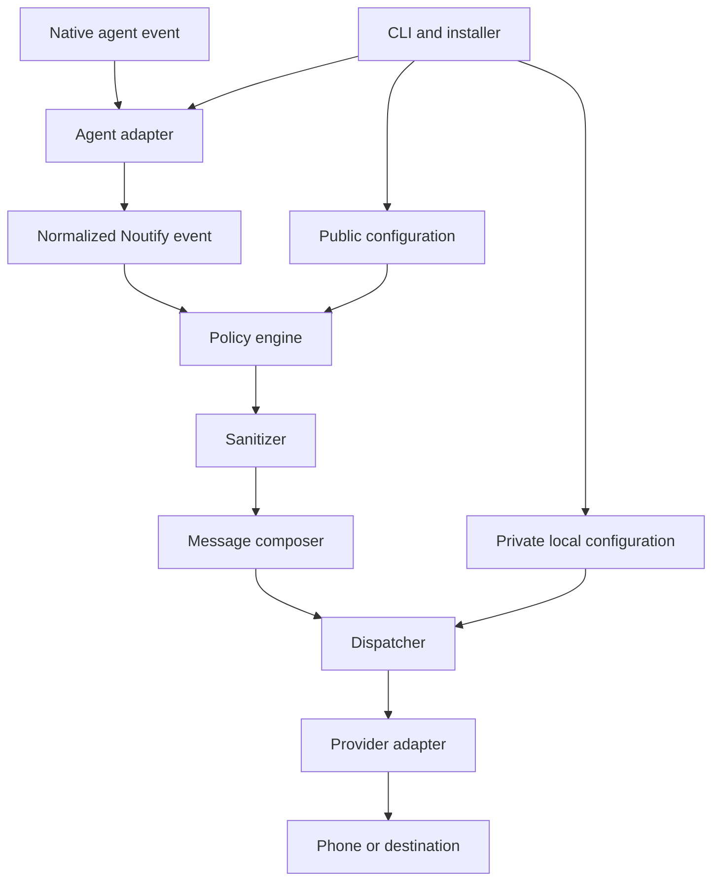

# Noutify — Master project context

> Status: canonical context; Phase 0 implemented with real-phone acceptance pending
> Last updated: 2026-08-07
> Audience: people and coding agents that design, implement or review Noutify

## 1. How to use this document

This file preserves Noutify's vision, confirmed decisions, boundaries and
roadmap. Before changing Noutify:

1. read this document;
2. inspect the actual repository and tests;
3. identify the active roadmap phase;
4. separate confirmed decisions from future possibilities;
5. avoid expanding scope without explicit approval;
6. update this file when a structural decision changes.

When sources conflict, use this precedence:

1. the user's latest explicit instruction;
2. code and tests for implemented behavior;
3. this document for product direction and architectural intent;
4. other repository documents;
5. historical conversations or assumptions.

Do not resolve product, security or scope conflicts silently.

## 2. Executive summary

Noutify is a local, portable bridge between coding-agent lifecycle events and a
user's phone. It lets the user stop watching an editor or terminal and return
when their attention is useful.

The product promise is:

> **Truthful, private mobile notifications for coding agents.**

Noutify normalizes agent-specific events into universal states, applies truth
and privacy policies, builds a short message, and sends it through a replaceable
notification provider. Delivery failures never block the agent's primary work.

### Current implementation

Phase 0 is a tested TypeScript vertical slice for Windows, Claude Code and ntfy.
It includes:

- truthful `WAITING` notification composition;
- Claude Code `Stop` payload handling;
- ntfy delivery with a five-second attempt timeout and one transient retry;
- separate public and private configuration;
- idempotent project-local Stop-hook installation;
- `setup`, `test`, `confirm`, `doctor` and `uninstall` commands;
- automated core, provider, configuration, installer, CLI and documentation
  contract tests.

Real-phone subscription, test receipt and a later automatic Stop notification
remain manual acceptance gates. Never report those gates as complete without the
phone owner's explicit confirmation.

## 3. Product vision

The target experience is “one prompt and done.” The default Phase 0 experience
is a project-local agent-guided installation:

1. The user places `Noutify/` inside the target project.
2. From the target-project root, the user sends:

   ```text
   Install Noutify following Noutify/SETUP.md.
   ```

3. Claude detects Spanish or English and runs the compact installer without
   asking the user for paths.
4. The installer validates, installs dependencies, tests, type-checks, builds,
   and configures the hook without replacing existing settings.
5. Claude reads the final structured record and shows a newly created topic once.
6. Claude guides the user through private ntfy subscription and testing.
7. The user explicitly confirms phone receipt.
8. Claude runs diagnostics and describes any remaining real-device acceptance.

The English setup contract is language-neutral infrastructure. Claude speaks in
the detected interaction language and uses `es` for Spanish or `en` for English.
Spanish and English notifications follow that choice; `/noutify language` can
change it later. New topics have the form `Noutify-[12 easy characters]`.
Commands, paths, filenames, configuration keys, and literal output remain
unchanged.

The project-local `Noutify/` directory remains in place because Phase 0 installs
an absolute path to its compiled runtime. Package-based distribution will remove
this limitation in a later phase.

## 4. Scope and boundaries

### Noutify is

- a local notification runtime;
- a normalizer for coding-agent events;
- a set of reversible agent adapters;
- a common interface for notification providers;
- an agent-executable setup contract;
- a CLI for setup, testing, diagnosis and removal;
- a portable project folder today and a package in the future.

### Noutify is not

- an application's customer-facing business notification system;
- an editor-specific extension;
- a replacement for the agent's visible report;
- a remote transcript reader or conversation summarizer;
- a Noutify mobile application;
- a backend, SaaS, account system or database;
- an observability or telemetry platform;
- a permission-granting mechanism.

### Outside the current MVP

- a Noutify mobile application or backend;
- accounts, dashboards, marketplaces or remote telemetry;
- providers other than ntfy;
- agents other than Claude Code;
- operating systems other than Windows;
- QR codes, deep links or interactive notification actions;
- enterprise automation.

## 5. Non-negotiable principles

### 5.1 Determinism before model memory

Native hooks and events trigger notifications. The model must not need to
remember to send one at the end of a turn.

### 5.2 Truth before enthusiasm

A notification never claims implementation, validation or completion without
evidence. Ending a response is not the same as completing a task.

### 5.3 Privacy by default

A notification is a doorbell, not a conversation summary. It contains the least
context needed and never carries transcripts, file contents, prompts, logs,
credentials or personal information.

### 5.4 Failure without interference

Provider failure must not block, change or meaningfully delay the agent's task.

### 5.5 Conservative integration

Installation merges safely and preserves existing configuration. Uninstall
removes only entries owned by Noutify.

### 5.6 Agent- and provider-neutral core

The core knows no Claude Code, ntfy or editor details. Adapters encapsulate those
differences.

### 5.7 Local first

The current product needs no Noutify backend, account or database. Private
configuration stays on the user's machine.

### 5.8 Idempotency

Repeated setup never duplicates hooks, alters unrelated data or degrades a valid
installation.

## 6. Universal event model

| Event | Meaning | Use |
|---|---|---|
| `WAITING` | The agent ended its turn and returned control to the user. | Whenever the session awaits another prompt, even if work is partial or blocked. |
| `ACTION_REQUIRED` | The agent needs a concrete human action or approval. | Permissions, destructive confirmations or authority-bound decisions. |
| `COMPLETED` | The requested work truly finished and required validation ran. | Only with sufficient completion evidence. |
| `BLOCKED` | Progress stopped after safe alternatives were exhausted. | External dependency, missing access or an unresolvable condition. |
| `ERROR` | A relevant technical failure occurred. | A failure worth notifying about; not automatically a total block. |

Essential distinctions:

- `WAITING` describes conversation state, not task outcome.
- `COMPLETED` is a strong evidence-backed assertion.
- `ACTION_REQUIRED` means the user can unblock work with a specific action.
- `BLOCKED` means safe local alternatives are exhausted.
- `ERROR` may be recoverable.

Phase 0 implements only `WAITING`. A Claude Stop hook may truthfully say that
the agent is waiting, but it cannot infer `COMPLETED`.

Conceptual normalized contract:

```ts
type NoutifyEventType =
  | "WAITING"
  | "ACTION_REQUIRED"
  | "COMPLETED"
  | "BLOCKED"
  | "ERROR";

interface NoutifyEvent {
  type: NoutifyEventType;
  occurredAt: string;
  project: string;
  agent?: string;
  sessionId?: string;
  sourceEvent?: string;
  summary?: string;
  correlationId?: string;
  metadata?: Record<string, unknown>;
}
```

This conceptual contract is not yet a public versioned API.

## 7. Architecture



### CLI and installer

The CLI validates inputs and exposes stable commands. The installer detects the
project, merges one owned hook, writes split configuration and supports safe
diagnosis and removal.

### Agent adapters

An adapter owns detection, native-event translation and hook lifecycle for one
agent. Phase 0 contains the Claude Code Stop adapter.

### Core

Core units normalize events, apply policy, sanitize content, compose messages,
deduplicate transitions and dispatch with bounded failure behavior.

### Providers

The core depends on a provider interface. ntfy is the first implementation;
other providers remain outside the current phase.

## 8. Agent-guided installation contract

`SETUP.md` is an operational interface for Claude, not background prose. It must:

- keep the successful state machine within 350 words and 2,500 characters;
- select `es` for Spanish interaction and `en` for English interaction;
- run `node Noutify/scripts/install.mjs --language <es|en>` without manual paths;
- parse its final structured `created` or `existing` record;
- show a newly created topic exactly once, but never repeat it;
- never repeat the topic in agent-authored text or artifacts;
- pause before sending a test;
- require explicit phone receipt before `confirm`;
- run `doctor` and disclose pending real-device acceptance accurately;
- preserve unrelated hooks and malformed settings instead of overwriting them;
- load `docs/setup-troubleshooting.md` only for recovery.

The standard user prompt is:

```text
Install Noutify following Noutify/SETUP.md.
```

Manual commands remain available for troubleshooting and automation, but they
are not the primary onboarding experience.

## 9. Notification flow and non-interference

1. Claude emits a native Stop payload.
2. The adapter validates and normalizes it to `WAITING`.
3. Configuration gates determine whether setup is confirmed and the event is
   enabled.
4. The composer creates a short truthful message.
5. The ntfy provider sends with a bounded timeout and one transient retry.
6. The hook exits silently regardless of provider failure.

Hooks must:

- write nothing to stdout;
- never grant or deny permission;
- use a short timeout;
- tolerate invalid input;
- avoid transcript access;
- never block the agent because notification delivery failed.

## 10. Message and security policy

Base format:

```text
[Project]: [truthful state or required action]
```

Messages should be short, factual and sanitized before truncation. Prohibited
content includes:

- secrets, tokens, passwords and API keys;
- credential files or environment variables;
- private authenticated URLs;
- cookies and authorization headers;
- transcripts, prompts and internal reasoning;
- source files, SQL, stack traces or extended logs;
- personal information and sensitive identifiers.

When a safe summary cannot be guaranteed, use a generic message.

## 11. Configuration

Public, versionable configuration describes shared behavior:

```json
{
  "version": 1,
  "project": { "name": "My Project" },
  "provider": { "type": "ntfy" },
  "events": { "waiting": true }
}
```

Private local configuration contains provider destination data:

```json
{
  "server": "https://ntfy.example",
  "topic": "<private-high-entropy-topic>",
  "setupCompleted": false
}
```

The private file is ignored by Git. Real topics, endpoints, tokens and
credentials never belong in commits, issues, documentation, screenshots or
fixtures.

## 12. Commands

Implemented Phase 0 commands:

```text
noutify setup [--project PATH] [--server URL] [--topic TOPIC]
noutify test [--project PATH]
noutify confirm [--project PATH]
noutify doctor [--project PATH]
noutify uninstall [--project PATH]
```

`hook claude-stop` is internal, silent and non-blocking.

## 13. Testing and acceptance

Automated coverage includes:

- truthful WAITING composition;
- Claude Stop payload validation;
- configuration validation and rollback;
- private-file ignore behavior;
- safe hook merge, idempotency and uninstall;
- CLI option handling and silent internal hooks;
- ntfy success, timeout and transient retry;
- documentation installation-contract consistency.

The full Phase 0 journey still requires a real phone:

1. place `Noutify/` in a clean Windows target project;
2. send the one-line setup prompt;
3. subscribe the phone without exposing the topic;
4. receive `Noutify connected`;
5. explicitly confirm receipt;
6. allow a later Claude turn to stop;
7. receive `Agent waiting` without a false completion claim.

## 14. Roadmap

### Phase 0 — Vertical proof

- Windows, Claude Code and ntfy;
- `WAITING` from the Stop hook;
- project-local agent-guided installation;
- split public/private configuration;
- phone test and explicit confirmation.

### Phase 0.1 — Reliable MVP

- remaining universal event types;
- sanitizer, truth policy and deduplication;
- backup and richer recovery behavior;
- dry-run and expanded integration coverage.

### Phase 0.2 — Portability

- macOS and Linux;
- shell wrappers, permissions and compatibility matrix.

### Phase 0.3 — Multiple agents

- additional adapters only after verifying official lifecycle mechanisms;
- explicit capability tables and documented degradation.

### Phase 0.4 — Distribution

- a publishable package;
- `npx noutify init`;
- generated local runtime and refined mobile onboarding;
- safe QR codes or deep links where supported.

### Phase 1.0 — Stable product

- one-command installation;
- versioned public contracts and migrations;
- documented support and release policy;
- reproducible onboarding in unrelated projects.

Additional providers, enterprise features, a GUI and interactive notifications
are future possibilities, not commitments.

## 15. Confirmed decisions

- The product name is Noutify.
- It is independent of any specific editor or application repository type.
- The core is TypeScript on Node.js.
- Agent and provider integrations use adapters.
- Phase 0 uses only Claude Code, ntfy and Windows.
- Deterministic hooks are the primary trigger.
- Public and private configuration remain separate.
- Topics and credentials are never versioned.
- Installation merges; it never replaces unrelated settings.
- Uninstall removes only Noutify-owned hook entries.
- Provider failure never blocks the agent's work.
- Phone receipt must be explicit before setup becomes active.
- The default onboarding is the project-local one-prompt flow.
- The setup contract stays in English while Claude localizes interaction.
- No Noutify mobile app, backend, account system or SaaS belongs in the MVP.

## 16. Open decisions

- final npm package name and publishing workflow;
- public versioned event and configuration schemas;
- a deterministic `COMPLETED` mechanism distinct from `WAITING`;
- minimal storage needed for deduplication;
- topic strategy across users, devices and projects;
- configuration migration policy;
- authenticated and self-hosted ntfy scope;
- distribution behavior before npm publication;
- localization policy for Noutify-generated notification messages.

Resolve open decisions explicitly before moving them into implementation.

## 17. Definition of done

A Noutify change is complete only when it:

- meets approved acceptance criteria;
- has tests proportional to risk;
- preserves existing configuration;
- introduces no trackable secrets;
- handles invalid input and provider failure safely;
- remains idempotent where required;
- updates documentation and master context;
- is verified in the claimed target environment;
- claims no untested compatibility.

## 18. North star

The primary measure is user trust, not notification volume:

> **The user can stop watching the agent and return exactly when their attention
> is useful.**

Every decision must improve that trust without sacrificing privacy, truth or
control over the local environment.
